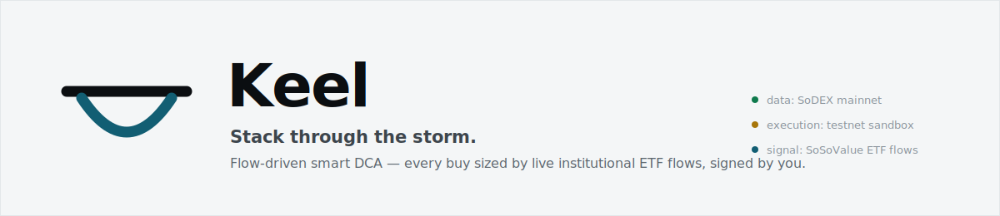
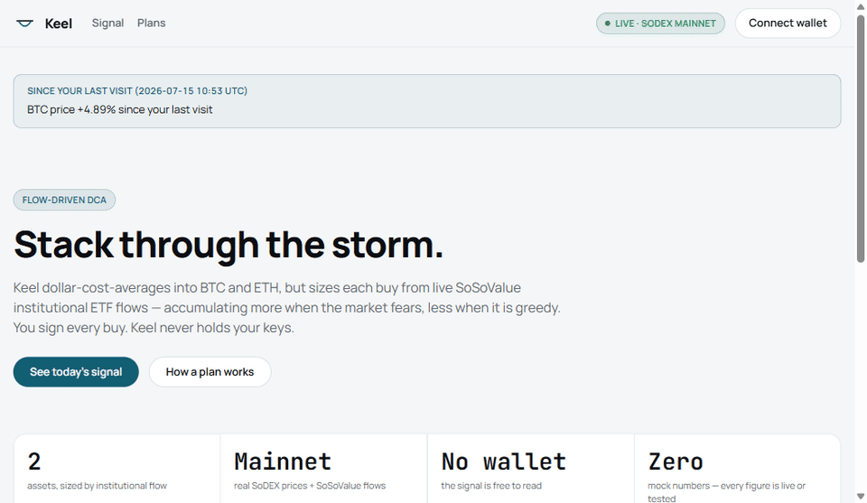
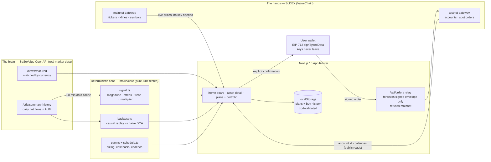

<div align="center">

<picture>
  <source media="(prefers-color-scheme: dark)" srcset="docs/assets/banner-dark.svg">
  
</picture>

**DCA is discipline. Keel gives it eyes.**

Accumulate BTC and ETH on a schedule — but let live institutional ETF flows size every buy,
and sign every order yourself.

[](https://github.com/pandeyritik963-rgb/keel/actions/workflows/ci.yml)
[](LICENSE)
[](https://keel-self-six.vercel.app)
[](https://mainnet-gw.sodex.dev)
[](docs/CLAIMS.md)

[Live app](https://keel-self-six.vercel.app) · [Demo](#demo) · [How the signal works](#how-the-signal-works) ·
[Architecture](#architecture) · [Quick start](#quick-start) · [Every claim, audited](docs/CLAIMS.md)

</div>

---

## What is Keel

Keel is a non-custodial dollar-cost-averaging app with one twist: the size of each buy is
computed from live institutional ETF flow data instead of being fixed.

Plain DCA buys the same amount every interval no matter what the market is doing. Keel
reads the daily net flows of US spot ETFs from the SoSoValue OpenAPI — the closest public
proxy for what institutions are actually doing with their money — and scales your base
amount between 0.50x and 2.00x. Under the default contrarian thesis it buys more on
outflow days (fear) and less on inflow days (euphoria); a momentum thesis inverts that,
per plan. You confirm and sign every order in your own wallet; execution runs on the
SoDEX spot testnet sandbox.

The whole flow in one line:

```
see today's signal  →  set a plan  →  brain sizes the buy from live flows  →  you confirm + sign  →  SoDEX executes  →  portfolio proves it vs naive DCA
```

## Demo

<div align="center">



*Captured from a live run: real SoDEX mainnet prices, real testnet account reads. Signal
panels show their explicit offline state because no SoSoValue key was configured in that
environment — Keel renders honest absence, never placeholder numbers.*

</div>

Try it now, no wallet needed: **https://keel-self-six.vercel.app**

| Surface | Screenshot |
| --- | --- |
| Home board — live prices, per-asset multiplier, "since your last visit" | [home-board.png](docs/demo/home-board.png) |
| Asset detail — factor breakdown, flow chart, replay vs naive DCA | [asset-detail.png](docs/demo/asset-detail.png) |
| Pre-trade confirmation — full restatement before any signature | [buy-confirmation.png](docs/demo/buy-confirmation.png) |

## Why Keel

Every accumulation strategy today forces a bad trade-off:

| | Buy sizing | Custody | Predictions | Auditability |
| --- | --- | --- | --- | --- |
| Naive DCA | fixed, blind to conditions | yours | none | trivial |
| Discretionary timing | emotional, inconsistent | yours | implicit | none |
| Typical "AI trading" bots | opaque model output | often theirs | constant | none — trust the black box |
| **Keel** | **deterministic function of public institutional flows** | **yours — wallet-signed, key never leaves** | **none — reacts to observed flows only** | **every number unit-tested + provenance-tagged; [claims ledger](docs/CLAIMS.md)** |

Three design commitments make Keel different, and they are enforced in code rather than
promised in copy:

1. **Deterministic over predictive.** The multiplier is a pure function
   (`src/lib/core/signal.ts`) of published flow data. Same inputs, same output, unit-tested.
   No model guesses a price; nothing in the product says "buy now".
2. **Non-custodial over convenient.** Keel cannot spend your funds. Orders are EIP-712
   signed inside your wallet; the server only relays the signed envelope and refuses
   mainnet outright until a real-funds surface exists.
3. **Honest over polished.** Disconnect the SoSoValue key and the signal goes loudly
   offline — it never falls back to a mock. Every financial figure carries unit,
   timeframe, and source, rendered through a component that makes unsourced values a
   compile-time impossibility.

## How the signal works

Each asset's daily ETF flow series is reduced to three factors, each in [-1, +1] where
+1 means strong inflows:

| Factor | Weight | What it measures |
| --- | --- | --- |
| Magnitude | 0.35 | today's net flow vs the typical size of recent flows |
| Streak | 0.30 | consecutive same-direction days, saturating at 5 |
| Trend | 0.35 | net directional bias over the 7-day window |

They combine into a composite flow score, and the thesis maps the score to a buy
multiplier, clamped to [0.50x, 2.00x] of your plan's base amount:

```
score      = 0.35·magnitude + 0.30·streak + 0.35·trend
contrarian = outflows (score < 0) scale the buy up toward 2.00x; inflows scale it down toward 0.50x
momentum   = the mirror image
```

From a live run on 2026-07-16: BTC's latest flow was +$181.08M (inflow, low conviction)
→ 0.92x, stance "steady"; ETH's was +$58.34M against a stronger inflow week (moderate
conviction) → 0.78x, stance "ease off". Both are inflows, so the contrarian thesis
correctly sized both buys below base. The asset page shows this same decomposition —
factor bars, weights, score, and the exact mapping — for every multiplier it displays.

When there is too little history (fewer than 3 days), the signal says so and holds the
1.00x base rather than extrapolating. When the key is missing or the API is down, the
buy flow refuses to size an order at all.

**The proof.** Every asset page replays flow-weighted DCA against naive DCA over real
history: SoSoValue daily flows joined with SoDEX daily closes on UTC date, multiplier
computed causally from only the flows known on each day, both strategies skipping the
same warm-up window. Headline metric is average cost per unit — base-amount-invariant,
so it is shown per $100 base. Your own portfolio gets the same treatment: each recorded
buy stores the naive counterfactual at the same submit-time price, so "your avg cost vs
naive DCA" is computed from your actual history, not a simulation. Both surfaces carry
the same caveat, always: a historical replay is not a prediction, and a trending market
can favor naive DCA.

## Architecture



The load-bearing split: **market data is mainnet-real, execution is testnet-sandboxed**,
and the two networks are configured independently so the boundary is explicit
(`SODEX_DATA_NETWORK` vs `SODEX_NETWORK`). The green "Live · SoDEX mainnet" pill and the
amber "testnet sandbox · no real funds" badge in the UI are permanent fixtures of that
split, not fine print.

Order signing was ported from SoDEX's official Go SDK (`sodex-go-sdk-public`): payload
hash over canonical compact JSON, EIP-712 domain `"spot"` with
`ExchangeAction(bytes32 payloadHash, uint64 nonce)`, wire signature `0x01 + r + s + v`.
Round-trip tests prove signatures recover to the signer.

## Honesty as a feature

Most dashboards fail silently and render a plausible zero. Keel treats that as the worst
bug it can ship, and builds against it structurally:

- **Five states on every data surface** — loading, empty (with a next action), error
  (specific cause and recovery), stale (last value with "as of"), populated. Enforced by
  the build constitution in [AGENTS.md](AGENTS.md).
- **Provenance is unskippable** — numbers render through `ValueWithProvenance`, whose
  `source` prop is required. An unsourced figure does not compile.
- **A public claims ledger** — [docs/CLAIMS.md](docs/CLAIMS.md) lists every user-facing
  claim, its basis in code or API, and what would falsify it. Reviewers hold changes to it.
- **Keyless build in CI** — the production build must pass with zero API keys configured,
  proving every offline path exists and compiles.
- **No hype vocabulary, no emojis, no "coming soon"** — the banned lexicon is written
  down and grepped for.

## Quick start

```bash
git clone https://github.com/pandeyritik963-rgb/keel.git
cd keel
npm install
cp .env.example .env.local    # add SOSOVALUE_API_KEY to light up the signal
npm run dev                   # http://localhost:3000
```

Prices work immediately with no keys (SoDEX market data is public). The flow signal,
backtest, and news need one key:

| Variable | Required | Purpose |
| --- | --- | --- |
| `SOSOVALUE_API_KEY` | for the signal | ETF flows + news. Server-only; ~20 req/min, cached 10 min server-side. Without it, signal surfaces render an explicit offline state. |
| `SODEX_DATA_NETWORK` | no (default `mainnet`) | where prices/klines are read |
| `SODEX_NETWORK` | no (default `testnet`) | where orders go; the relay refuses `mainnet` |
| `SODEX_API_BASE` | no | gateway override |

To execute a sandboxed buy end-to-end you also need an injected wallet (e.g. MetaMask)
and a wallet address provisioned on the SoDEX testnet — its write path is
whitelist-gated. Un-provisioned wallets get an honest rejection in the confirmation
dialog, not a spinner.

## Using it

1. **Read the signal** — the home board shows each asset's multiplier, stance, and the
   flow datapoint behind it. No wallet, no account.
2. **Open an asset** — see why the multiplier is what it is (factor bars, score,
   mapping), the raw flow series, the replay vs naive DCA, and matched news. Flip
   between contrarian and momentum.
3. **Create a plan** — base amount, cadence (daily / weekly / biweekly), thesis. Stored
   in your browser; nothing leaves it.
4. **Confirm a buy** — when a buy is due, the dialog restates asset, size and the
   multiplier that produced it, the signal's reasons, estimated price and quantity, the
   taker fee, and the worst case. Then — and only then — your wallet signs, and the
   signed order goes to the testnet gateway.
5. **Watch the proof accumulate** — the portfolio tracks your flow-sized cost basis
   against what naive DCA would have paid at the same moments, marked to the live price.

## Tech stack

| Layer | Choice | Why |
| --- | --- | --- |
| Framework | Next.js 15.5 (App Router), React 19 | server components keep API keys server-side; per-request live reads |
| Language | TypeScript, strict | wire types shared between routes and clients via `satisfies` |
| Styling | Tailwind CSS v4 `@theme` tokens | one source of truth for the design system; raw hex in components is forbidden |
| Wallet | wagmi v3 + viem | injected connect + EIP-712 signing; no RPC reads needed |
| Validation | zod on every external boundary | SoSoValue, SoDEX, localStorage, and route inputs are all parsed, never trusted |
| Money math | framework-free core + dnum at the order boundary | testable without mocks; decimal-safe funds strings |
| Testing | vitest | signal, backtest, plan math, cadence, signing round-trip, formatting |
| Deploy | Vercel | zero-config Next.js hosting |

## Repository structure

```
src/
  lib/
    core/        signal engine, backtest, plan + cadence math — pure, unit-tested
    sosovalue/   OpenAPI client: flows, news, rate limiting, zod schemas
    sodex/       spot client: markets, accounts, EIP-712 signing, order submission
    flows/       cached business layer over SoSoValue (10-min data cache)
    plans/       browser-local plan/buy store (zod-validated localStorage)
    insight/     composition: signal + price summaries, backtest assembly
    api/         wire types shared by routes and client components
  app/
    page.tsx             signal board + what-changed strip
    assets/[id]/         asset detail: factors, flow chart, replay, plan form
    plans/               plans board, buy confirmation, portfolio proof
    api/                 signal/account reads + the order relay
  components/    ui kit (five-state primitives, provenance), signal, plans, wallet
docs/
  CLAIMS.md      every user-facing claim → basis → falsifier
  demo/          screenshots + walkthrough GIF from live runs
AGENTS.md        the build constitution (enforced, not decorative)
brand.md         color, type, mark, and voice rules
```

## Testing and CI

```bash
npm run test && npm run typecheck && npm run lint && npm run build
```

The deterministic core is where every displayed number is born, and it is tested without
any mocking of markets: 35 unit tests cover the signal factors and clamps, the causal
backtest, plan and cadence math, formatting edge cases, and the EIP-712 signing
round-trip (signature recovers to the signer). CI runs all four checks on every push —
with no API keys, deliberately.

## Not built yet, by design

These are known gaps, listed here so the current scope is unambiguous:

- Mainnet execution. The relay hard-refuses it today; it opens only behind an
  unmistakable real-funds confirmation surface.
- Fill readback. The portfolio marks buys at the submitted estimate and says so; reading
  actual fills from SoDEX order state is the natural next step.
- More assets. SoSoValue publishes flows for SOL, XRP, and others; an asset ships only
  when it has both a flow series and a liquid SoDEX spot market (one row in
  `src/lib/assets/catalog.ts`).
- Durable history. Server-side snapshotting of flow data (Vercel Blob) so backtests can
  reach further than the API's window.
- Narration. An LLM layer that explains verified numbers with provenance — it will never
  compute one.

## FAQ

**Why does the live demo say "Signal offline"?**
No `SOSOVALUE_API_KEY` is configured in that deployment. This is the designed behavior:
Keel renders explicit absence rather than fake data. Prices are still live because SoDEX
market data needs no key.

**Is this financial advice?**
No. Keel makes no predictions and issues no recommendations. It applies the thesis you
chose to public flow data, shows its work, and requires your signature for every action.

**Can it buy without me?**
No. There is no auto-execution path in the codebase — no scheduler, no server-side
signer, no session keys. A buy exists only downstream of a confirmation dialog and a
wallet signature.

**Why is execution on testnet?**
Two of the wedge's guarantees — "you can try the full flow" and "no one loses real money
to an unaudited order path" — conflict on mainnet. The testnet sandbox resolves that
while keeping the market data real. The mainnet path stays closed until it has its own
real-funds confirmation surface.

**What happens if SoSoValue or SoDEX goes down?**
Each surface degrades independently and loudly: prices can be live while the signal is
offline, and vice versa. The buy dialog refuses to size an order without a live signal
and refuses to build one without live market metadata.

**Where is my data?**
Plans and buy history are in your browser's localStorage, validated on read. There is no
server database, no account, and nothing to breach.

## Contributing

Read [AGENTS.md](AGENTS.md) first — Keel is built under an enforced constitution: real
data or an explicit failure state, deterministic and unit-tested money math, five UI
states per surface, non-custodial invariants, and a claims ledger. The merge gate lives
in [CONTRIBUTING.md](CONTRIBUTING.md). Security model and reporting:
[SECURITY.md](SECURITY.md).

## License

[MIT](LICENSE).

## Acknowledgements

- [SoSoValue](https://sosovalue.com) — the OpenAPI ETF flow and news data that the
  signal is built on.
- [SoDEX / ValueChain](https://sodex.dev) — spot market data, the testnet sandbox, and
  the open Go SDK that documents the spot signing scheme.
- Manrope and JetBrains Mono, the two typefaces that carry the entire interface.

---

<div align="center">

**Stack through the storm.**

Keel — the part of the ship below the waterline that keeps you upright in weather.

</div>
